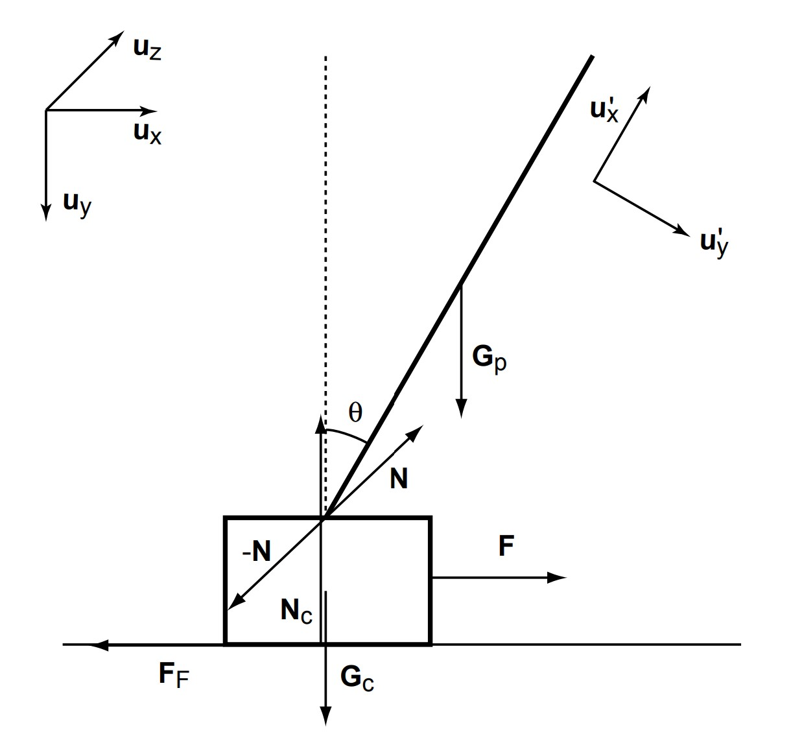

The inverted cart pendulum system serves as a classic benchmark problem for studying the control
of dynamical systems. The system consists of a cart connected to a pole along a track, as seen
in the figure below. This system proposes a challenging control problem as it has inherently non-linear, unstable and under-actuated dynamics.

 
    
    

The objective in this repository, is to determine the optimal action selection policy using a Q-learning algorithm to maintain upright balance of the pole by forcing the cart to the left or right. The environment developed represents the continuous state space as discrete and is inspired by Gym’s cart pole environment [1]. The optimal action selection policy is obtain through careful tuning of the Q-learning parameters.

The following video displays the dynamics of the inverted cart pendulum system when controlled by the resulting action selection policy obtained from the Q-learning algorithm.

      
    <video controls="controls">
        <source src="cartpole.mp4" type="video/mp4"/>
    </video>

